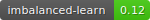

<!-- Improved compatibility of back to top link: See: https://github.com/othneildrew/Best-README-Template/pull/73 -->
<a id="readme-top"></a>
<!--
*** Thanks for checking out the Best-README-Template. If you have a suggestion
*** that would make this better, please fork the repo and create a pull request
*** or simply open an issue with the tag "enhancement".
*** Don't forget to give the project a star!
*** Thanks again! Now go create something AMAZING! :D
-->


<!-- PROJECT SHIELDS -->
<!--
*** I'm using markdown "reference style" links for readability.
*** Reference links are enclosed in brackets [ ] instead of parentheses ( ).
*** See the bottom of this document for the declaration of the reference variables
*** for contributors-url, forks-url, etc. This is an optional, concise syntax you may use.
*** https://www.markdownguide.org/basic-syntax/#reference-style-links
-->
[![LinkedIn][linkedin-shield]][linkedin-url]


<!-- PROJECT LOGO -->
<br />
<div align="center">
  <a href="https://github.com/othneildrew/Best-README-Template">
    
  </a>
</div>

<!-- ABOUT THE PROJECT -->
## Sobre o Projeto

[![Product Name Screen Shot][product-screenshot]](https://roger-sampaio-churn.streamlit.app/)

A Operadora de telefonia norte-americana Telecom está enfrentando um problema com a alta rotatitividade de clientes. Devido a ampla concorrência no mercado de outras operadoras, clientes estão cada vez mais cancelando os contratos e deixando a empresa. Após reuniões com executivos, constatou-se o problema de churning. A métrica de churning é calculada através da quantidade de clientes que sairam até o final do período dividido pelo total de clientes que iniciam. Exemplo: se você perdeu 10 clientes de 100 = 10% de churn rate.
Contratou-se uma equipe de Ciência de Dados e Inteligência Artificial para construção de uma solução analítica para resolução do problema. Então Cientista de Dados decidiram construir um modelo de Machine Learning que prevesse quais eram os clientes mais propensos a cancelarem o contrato, resultado dado mensalmente. Logo com base na previsão, poderia contratar os clientes prováveis a cancelarem os contratos e renegociar através de ações de marketing como, por exemplo, redução dos custos de ligações.


Recursos(Features).
Foram utilizados um total de 2.666 contratos de clientes, considerando vários itens:
* Ligações. Custos associados, duração total em minutos, quantidade efetivada. Essas variáveis foram calculadas em três turnos distintos: matutino, vespertino e noturno.
* Localidade. Estado e código da área do cliente.
* Características extra do plano contrato. Suporte a ligações internacionais ou não, correio de voz ou não.
* Call-center. Quantidade de ligações associadas ao call-center(central de atendimento).

A proposta de solução contempla os seguintes passos de um processo de Ciência de Dados:
* Entendimento do Negócio.
* Obtenção das Bases de Dados.
* Análise Exploratória.
* Construção do Modelo Preditivo.
* Avaliação de Resultados. Inclui também a apresentação não técnica para executivos.
* Otimização de Resultados (através de ajuste de hyperparâmetros).
* Implantação(deploy). Está disponível para todos em uma URL pública para inferência em tempo real.
* Monitoramento(retreino e avaliação de data-drift). Não disponível, sendo uma possível sugestão de melhoria para a versão do projeto.

Base de dados utilizada: https://www.kaggle.com/datasets/mnassrib/telecom-churn-datasets

<p align="right">(<a href="#readme-top">Voltar para o topo</a>)</p>


### Construído com

Essa seção lista as linguagens de programação utilizadas assim como os pacotes. Veja:
* 
* 
* 
* 
* 
* 
<p align="right">(<a href="#readme-top">back to top</a>)</p>


<!-- GETTING STARTED -->
## Iniciando
Estão listadas as instruções de como executar o projeto localmente.


### Pré-requisitos

O projeto foi criado com Python versão 3.9.19 e Anaconda versão 23.7.4, trabalhando com ambiente virtuais. 


### Instalação.

1. Clone o repositório abaixo em sua máquina local.
   ```sh
   git clone https://github.com/rogercsampaio/churning
   ```
3. Abra o terminal do Anaconda e crie um ambiente virtual, recomendado criar na mesma pasta no qual você clonou o projeto. Substitua --env nome-- pelo nome do ambiente virtual.
   ```sh
   conda create -n <env nome> python=3.9.19
   ```
   Exemplo de uso.
   ```sh
   conda create -n churn python=3.9.19
   ```
4. Ative o ambiente criado recentemente `churn`
   ```sh
   conda activate churn
   ```
5. Navegue a pasta raiz do projeto pelo terminal e instale os pacotes necessário para execução do projeto.
   ```sh
   conda install --yes --file requirements.txt
   ```
6. Para teste final, execute o comando abaixo. O projeto será aberto no navegador padrão(por meio de uma interface gráfica) em localhost.
   ```sh
   streamlit run streamlit_app.py
   ```  

<p align="right">(<a href="#readme-top">Voltar para o topo</a>)</p>


<!-- USAGE EXAMPLES -->
## Uso

O projeto tem a intenção/objetivo de demonstrar na prática um modelo de machine learning de ponta a ponta, desde o entendimento de negócio até a implantação. Pode ser utilizado por Cientista de Dados,Analista de Dados, Engenheiros de Dados, entusiastas ou estudantes com interesse na área de Inteligência Artificial.

<p align="right">(<a href="#readme-top">Voltar para o topo</a>)</p>


<!-- LICENSE -->
## Licença

Distribuído sobre a licença Roger Sampaio. Veja `LICENSE.txt` para mais informações.

<p align="right">(<a href="#readme-top">Voltar para o topo</a>)</p>


<!-- CONTACT -->
## Contato

Roger C. Sampaio </p>
Email: rogersampaioo@gmail.com </p>
Linked: <a href="https://www.linkedin.com/in/roger-csampaio/">https://www.linkedin.com/in/roger-csampaio</a> </p>
Site: <a href="https://rogersampaio.com">rogersampaio.com.br</a> </p>
Link do projeto: <a href = "https://github.com/rogercsampaio/churning"> Git </a> </p>
<p align="right">(<a href="#readme-top">Voltar para o topo</a>)</p>


<!-- MARKDOWN LINKS & IMAGES -->
<!-- https://www.markdownguide.org/basic-syntax/#reference-style-links -->
[contributors-shield]: https://img.shields.io/github/contributors/othneildrew/Best-README-Template.svg?style=for-the-badge
[contributors-url]: https://github.com/othneildrew/Best-README-Template/graphs/contributors
[forks-shield]: https://img.shields.io/github/forks/othneildrew/Best-README-Template.svg?style=for-the-badge
[forks-url]: https://github.com/othneildrew/Best-README-Template/network/members
[stars-shield]: https://img.shields.io/github/stars/othneildrew/Best-README-Template.svg?style=for-the-badge
[stars-url]: https://github.com/othneildrew/Best-README-Template/stargazers
[issues-shield]: https://img.shields.io/github/issues/othneildrew/Best-README-Template.svg?style=for-the-badge
[issues-url]: https://github.com/othneildrew/Best-README-Template/issues
[license-shield]: https://img.shields.io/github/license/othneildrew/Best-README-Template.svg?style=for-the-badge
[license-url]: https://github.com/othneildrew/Best-README-Template/blob/master/LICENSE.txt
[linkedin-shield]: https://img.shields.io/badge/-LinkedIn-black.svg?style=for-the-badge&logo=linkedin&colorB=555
[linkedin-url]: https://www.linkedin.com/in/roger-csampaio/
[product-screenshot]: images/screenshot.png
[Next.js]: https://img.shields.io/badge/next.js-000000?style=for-the-badge&logo=nextdotjs&logoColor=white
[Next-url]: https://nextjs.org/
[React.js]: https://img.shields.io/badge/React-20232A?style=for-the-badge&logo=react&logoColor=61DAFB
[React-url]: https://reactjs.org/
[Vue.js]: https://img.shields.io/badge/Vue.js-35495E?style=for-the-badge&logo=vuedotjs&logoColor=4FC08D
[Vue-url]: https://vuejs.org/
[Angular.io]: https://img.shields.io/badge/Angular-DD0031?style=for-the-badge&logo=angular&logoColor=white
[Angular-url]: https://angular.io/
[Svelte.dev]: https://img.shields.io/badge/Svelte-4A4A55?style=for-the-badge&logo=svelte&logoColor=FF3E00
[Svelte-url]: https://svelte.dev/
[Laravel.com]: https://img.shields.io/badge/Laravel-FF2D20?style=for-the-badge&logo=laravel&logoColor=white
[Laravel-url]: https://laravel.com
[Bootstrap.com]: https://img.shields.io/badge/Bootstrap-563D7C?style=for-the-badge&logo=bootstrap&logoColor=white
[Bootstrap-url]: https://getbootstrap.com
[JQuery.com]: https://img.shields.io/badge/jQuery-0769AD?style=for-the-badge&logo=jquery&logoColor=white
[JQuery-url]: https://jquery.com 
